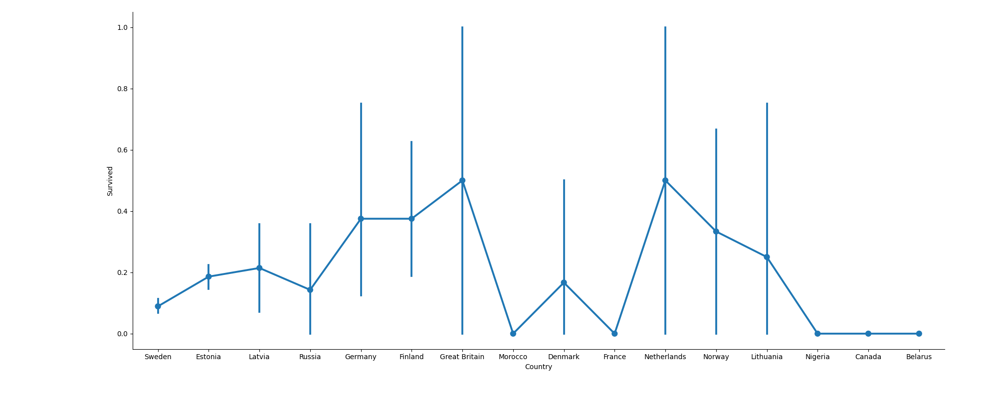
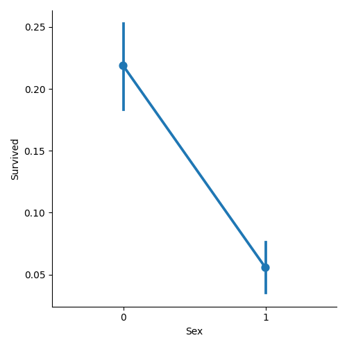
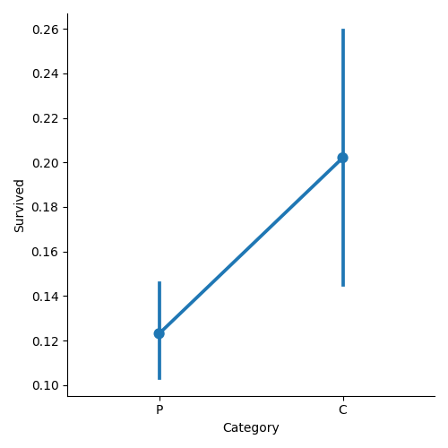

# Who survived the MS Estonia?

The MS Estonia sank in the Baltic Sea in 1994. Unfortunately, there were only 137 survivors of the 989 people on board.
Although tragic, there exists a question of what led those 137 to survive. Did it have to do with their age, gender, or what type of passenger they were? Since shipwrecks are typically self contained, (the dataset provides the necessary data needed to make a prediction), this python script explores how different machine learning algorithms predict the fates of the passengers and crew.

**Exploring and Cleaning the Data:**

**Age vs Survival Correlation:

The age vs survival plot seems to suggest that children are more likely to survive. However outside of that, there don't seem to be any distinct correlations.  

**Country vs Survival Correlation:**

The country vs survival plot doesn't seem to suggest any correlations. On first glance it appears that German and English passengers have a better chance of surviving, but the error magrin is much larger, so I wouldn't be willing to make any hyptoheses based on them.

**Men (0) vs Women (1) Survival Correlation:**

The gender plot is very revealing. There is an obvious correlation between being a male and survival. This is intersting because shipwrecks tend to see higher survival for women because of the way people are funneled into lifeboats (Women and children first). My hypothesis is that the gender correlation is intertwined with the passenger vs crew correlation because more of the crew members were men. **However, this turned out not to be the case because the gender breakdown of the crew was almost a 50-50 split.**

**Passenger vs Crew Survival Correlation:**

The passenger vs crew plot also suggested that there was a correlation between being a crew member and survival. This also goes against the standard of seeing crew members let passengers board first. 

